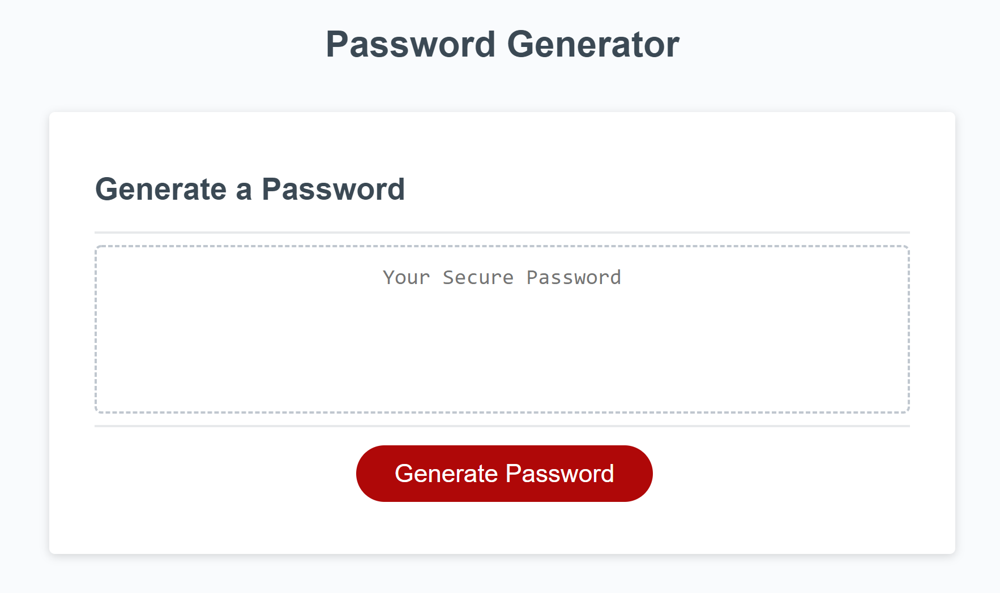
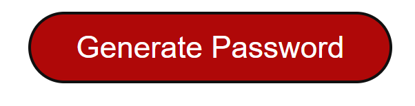
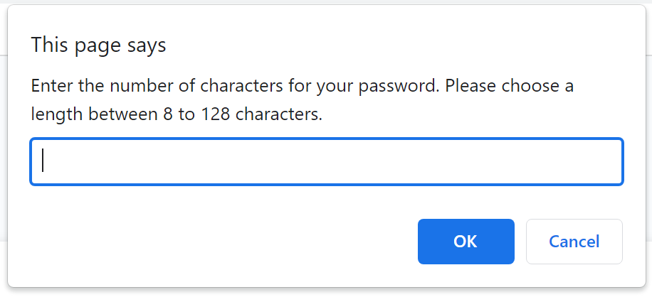
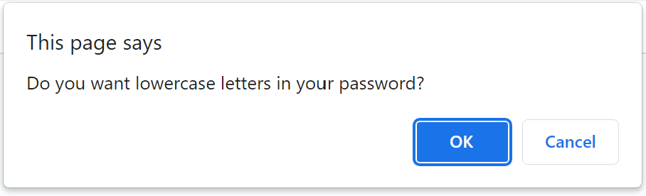
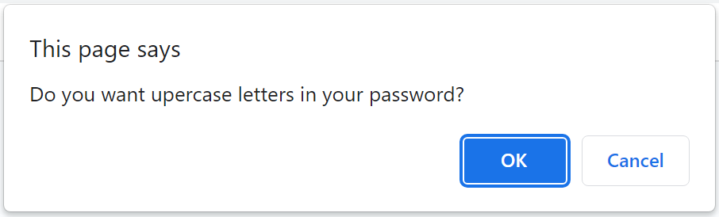
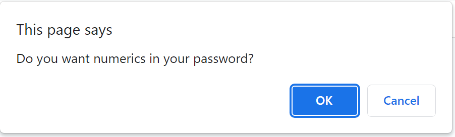
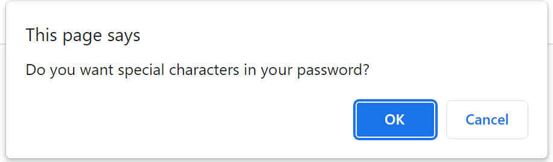

# Password-Generator-by-Jemima-Siddiqui

Homework Assignment for Week 3 by Jemima Siddiqui. 

# 03 About the Project - Password Generator

The Password Generator project consists of an application where users are able to generate passwords based on a specified criteria. By clicking on "Generate Password", users are presented with a series of prompts for the password generator to generate a random password based on user input. The prompts ask the user about the length of the password (8-128 characters), and confirm whether or not to include lowercase, uppercase, numeric, and/or special characters. The corresponding random password is then generated and displayed on the page. 


## Acceptance Criteria

The password generator application fulfills the following acceptance criteria: 

* When users click on the generate a password button, a series of prompts appear on the screen for password criteria  
* When users are promoted with the password criteria, they select the criteria they want to include in the password 
* When prompted for the length of the password, users are asked to choose a length of between 8 to 128 characters 
* The prompts then ask the user to confirm whether or not to include lowercase, uppercase, numeric, and/or special characters
* When all prompts are answered, a password is generated that matches the selected criteria 
* Once the password is generated, it is written to the page inside a text-box

## Installation

### Viewing the homepage 

In order to access the password generator application, navigate to the following link: 
 [Password generator page](https://jemimasiddiqui.github.io/Password-Generator-by-Jemima-Siddiqui/Develop/index.html). 

### Downloading Visual Studio Code 

 Download the latest version of Visual Studio to your local machine (Mac, Linux or Windows). Please use the following link to download the latest version of VS Code [Download VS Code](https://code.visualstudio.com/download). 

### Pulling the repository from Git 

If you would like to acess the source code (HTML, CSS and JavaScript files), please navigate to the following public Github repository [Github Repository](https://github.com/JemimaSiddiqui/Password-Generator-by-Jemima-Siddiqui.git). 

* Clone the repository to your local desktop using the following steps:

  * 🔑 Use the terminal command `cd` to navigate to the directory where we want the repository located. In this case, we will save it to the Desktop. 

  ```bash
  cd Desktop
  ```

  * 🔑 Use the git command `git clone` followed by the URL copied from Github to clone the repo to our local machine.

  ```bash
  git clone <url>
  ```

  * 🔑 Use the `git clone` command creates a new directory with the same name as the repository. We navigate into our new directory using `cd`.

  ```bash
  cd Password-Generator-by-Jemima-Siddiqui
  ```
* After the repository has been cloned to your local machine, open the HTML, CSS and JavaScript files using Visual Studio application. 

## Usage 

This section contains instructions on how to use the password generator application. 

1. Application page: 

The application page consists of a "Generate Password" button and a text-box. 



2. Generate button:

Once users click on the "Generate Password" button, they are presented with a series of prompts to confirm the criteria of the password they would like to generate.



3. Text-box for generated password:

After the user input is validated, a random password corresponding to the user input is generated and displayed in the text-box. 


4. Prompt for length of the password: 

The first prompt presented to users is the length of the password which can range from 8 to 128 characters. In a case where users input a character length outside the specified character length boundary, the prompt appears on the screen again. The prompt will remain appearing on the screen until the user inputs a number between 8 and 128 for the character length. 



5. Prompts to confirm whether or not to include lowercase, uppercase, numbers and special characters in the password: 

Following the character length prompt, users are presented with a series of prompts to confirm whether or not to include lowercase, uppercase, numbers and special characters in the password. They can either click on "ok" or "cancel" to say "yes" or "no" to the question respectively. 










## Credits

* This README.md file was created through the help of the following tutorial: [Professional README Guide](https://coding-boot-camp.github.io/full-stack/github/professional-readme-guide).

## Main Features

* This webpage consists of the following features: 
  * A "Generate Password" button which can be clicked to be presented by a series of prompts to confirm the criteria of the password to be generated. 
  * A series of prompts which ask the user about the character length of the password, and whether the password should include lowercase, uppercase, numbers and/or special characters. 
  * A text-box in which a random password is displayed once it has been generated based on users' inputted criteria.
---
© 2022 Trilogy Education Services, LLC, a 2U, Inc. brand. Confidential and Proprietary. All Rights Reserved.

